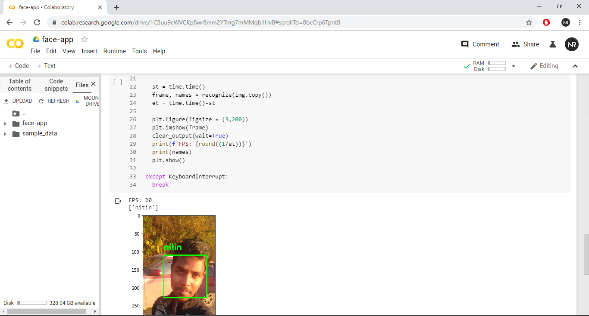
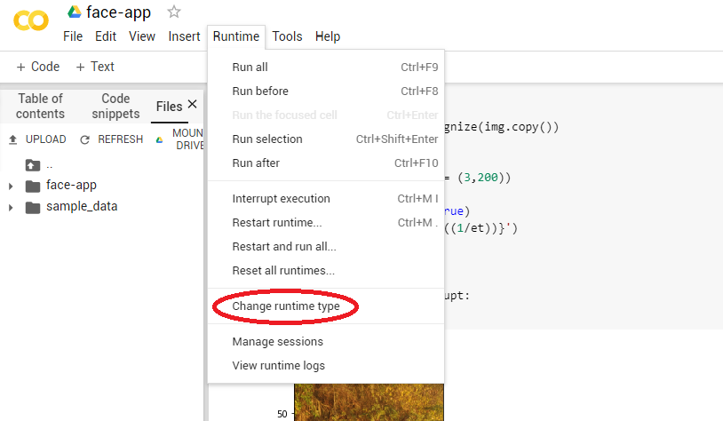
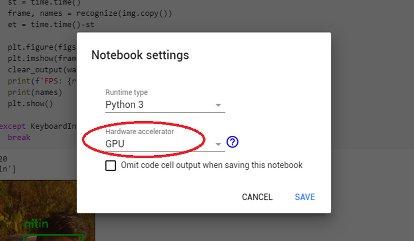

## Face app

Today i am going to show you how to train your own face recognition model for free, yes we are going to use **Google Colab** free GPU support to train the model.

> **Here's the challenge**
>
> We only have single image per person

The main concept is, we will use Keras data augmentation API to generate pseudo training images, not to mention we are going to use parallel programming techniques to augment and extract embeddings faster  making full use of all the free resource available on Colab.

like any other tutorials we are not going to make any dedicated colab notebook, instead we will just git clone this repository on colab and do our stuff.

**Start Here** [Colab Notebook](https://colab.research.google.com/github/imneonizer/face-app/blob/master/face_app.ipynb)

### Working Output

This was the final output when i was working on the project.

****

#### Don't forget to change your runtime type to GPU

- Menu

- Hardware accelerator

Later you can use ``test_model.py`` to recognize faces in images / videos, currently it is written for images. don't forget to have a look at this awesome library [imstream](https://github.com/imneonizer/imstream) for high fps video capturing.

#### Resources
[Face Applications](https://www.pyimagesearch.com/category/faces/)
